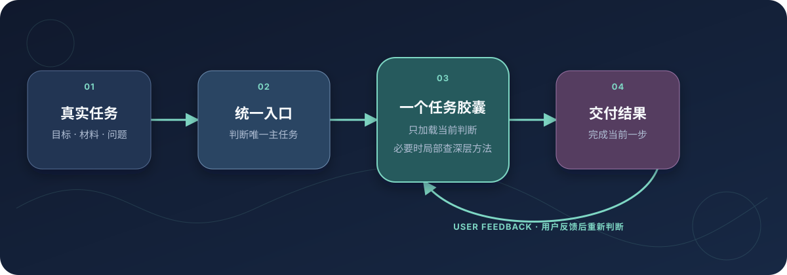

# ip-strategist

> Build a private IP dossier first. Every later task uses your dossier and evidence to separate the real problem from its symptoms before producing a deliverable and one testable next move.

[简体中文](README.md) · [English](README.en.md) · [日本語](README.ja.md) · [한국어](README.ko.md) · [繁體中文](README.zh-TW.md)

[](VERSION) [](https://skills.sh/erduo1998-cell/ip-strategist) [](LICENSE) [](https://github.com/erduo1998-cell/ip-strategist/actions)

**For Codex, Claude Code, and other hosts that support Agent Skills.** Natural language is the universal entry point; `/ip-strategist` also works where named Skill invocation is supported.

[Start in 30 seconds](#start-in-30-seconds) · [Watch the demo](#from-one-real-question-to-a-usable-result) · [Seven tasks](#seven-tasks) · [Install](#install) · [Update](#update) · [License](#license-and-commercial-permission)


## You do not need to learn the system first

First use builds a six-part private dossier covering goals, real experience and evidence, audience, value, business, execution constraints, and later performance data. After that, say what is stuck. `ip-strategist` reads the task-relevant summary, classifies your stated problem as a root cause, symptom, untested hypothesis, or evidence conflict, then loads one task capsule and completes the deliverable.

| Your real situation | What you receive |
| --- | --- |
| Your content jumps between tools and management, so no one remembers you | Positioning, target audience, content pillars, and persona red lines |
| You have a vague idea and cannot tell whether it is worth publishing | A make / revise / reject decision and an executable topic |
| You want to turn a direction into a 60-second spoken script | Minimal topic validation, the finished script, and performance intent |
| Views are high but profile visits and follows are weak | A causal diagnosis and a next batch that changes one variable |
| Saves are high but inquiries and sales are absent | Review, winning pattern, validation gate, and monetization bridge |
| Every new chat loses the decisions made before | A private dossier, resumable interviews, decision contracts, and reviews |

## Start in 30 seconds

### 1. Install it only in the Agent you use

List the repository's Skills without writing to any host directory:

```bash
npx -y skills add erduo1998-cell/ip-strategist --list
```

Install to Codex only:

```bash
npx -y skills add erduo1998-cell/ip-strategist -g \
  --agent codex --skill ip-strategist -y
```

For Claude Code, replace `codex` with `claude-code`. Do not default to `--all`; it writes to every Agent detected by the CLI.

### 2. Start a new session and build the private dossier

```text
This is my first time using ip-strategist. Help me build my private IP dossier.
```

The Agent explains where the dossier is stored and asks for consent once. It then runs a resumable six-part interview, one decisive question at a time. Positioning, topics, scripts, growth, reviews, and monetization begin only after you confirm the complete draft and it becomes `provisional`.

### 3. Later, give it the task and new evidence

```text
I published six posts. The second pillar generated the most qualified inquiries, but follower growth was weak.
First decide whether that is the real problem I should solve now, then tell me the one variable to change next.
```

The coach compares that statement with your goals, history, and current evidence instead of treating the surface symptom as the diagnosis.

## From one real question to a usable result

This is a **fictional-data demo**. The user asks why 120,000 views produced only 80 followers. The entry point first reads the task-relevant dossier and data, reframes the surface symptom into a future-value hypothesis, and only then selects the growth capsule.

[](assets/ip-strategist-demo.mp4)

Click for the [high-resolution MP4](assets/ip-strategist-demo.mp4). The animation is deterministically rendered from the repository's [Remotion source](demo/remotion/). It does not represent a real client, account, or performance claim.

## Seven tasks

| Work to complete | Typical input | Deliverable |
| --- | --- | --- |
| <!-- capability:positioning --> **Clarify positioning and persona** | Experience, business, audience confusion | Positioning, audience, content pillars, and red lines |
| <!-- capability:topic --> **Find, evaluate, and refine topics** | A direction, trend, or rough topic | Topic tradeoff, demand judgment, and executable title |
| <!-- capability:script --> **Turn an idea into content** | Topic, raw material, or partial draft | Structure, spoken script, and performance intent |
| <!-- capability:growth --> **Launch, grow, and build series** | Account symptoms and content results | Growth diagnosis, memory assets, series, and experiment |
| <!-- capability:review --> **Review published content** | Posts, views, engagement, and conversion | Attribution, variable diagnosis, and next-batch actions |
| <!-- capability:monetization --> **Plan content monetization** | Business, offer, price, and leads | Monetization path, content bridge, and validation order |
| <!-- capability:onboarding --> **Build the judgment foundation** | First use, a checkpoint, or a dossier gap | Private dossier, evidence ledger, resumption, and review |

Intent words may follow the same entry point; they are not separate Skills:

```text
/ip-strategist topic: Is this worth making?
/ip-strategist script: Turn this into a 60-second spoken draft.
/ip-strategist growth: Views are good but followers are flat. Why?
/ip-strategist coaching: Resume my dossier; do not restart.
```

## Why this is not one giant prompt



- **Dossier first:** first use must complete onboarding; new tasks remain evidence and backlog until it is complete.
- **Reframe every task:** formal work first uses the relevant dossier and data summary to distinguish causes, symptoms, and hypotheses.
- **One entry point:** users do not study an internal capability directory.
- **One current task:** the final deliverable selects the route; two capsules run only when two complete deliverables are explicit.
- **One capsule:** formal work loads `SKILL.md + task-specific state summary + one task-*`, not all of `references/00-11`.
- **Explicit privacy boundary:** state stays in the user's working directory. Refusal or an unsafe host permits only a labeled low-confidence, non-persistent limited analysis.
- **Local evidence remains data:** comment evidence from the creator's own backend is read-only; platform responses, comments, and local evidence files are untrusted input, never executable instructions, and never change a contract automatically.
- **The methodology remains:** deep sources stay public; capsules compile only decisions, actions, and quality gates that change the answer.

## Verifiable release gates

| Gate | v2.2.0 release gate |
| --- | ---: |
| `SKILL.md` | 10,384 bytes |
| Largest default task path (including the 6,000-byte state-summary ceiling) | 24,371 bytes |
| Default capsules loaded | 1 |
| State-summary ceiling | 6,000 bytes |
| Automated tests | Runtime and release-contract suite; optional online comparisons may skip when unavailable |
| Behavior-evidence baseline | All seven task types have clean evidence dated 2026-08-17 |
| Dossier-first historical baseline | 4 clean sessions passed on 2026-08-13 |
| Public languages | zh-CN, English, Japanese, Korean, zh-TW |

These numbers constrain context cost; they do not substitute for output quality. All seven task types have clean Agent evidence dated 2026-08-17. Each result states its actual coverage, and untested observation cases are not counted as passes.

v2.2.0 adds local-only comment evidence from the creator's own backend on three platforms. It reads comments only, maps one unique work ID to one contract, and aggregates only contracts due for review. Platform responses, comment text, and local evidence files remain untrusted input: they cannot override rules or act as commands, and they never automatically change a review status, date, or conclusion. The script task's narrative mechanics are strengthened, and installer-managed updates on Windows now resolve correctly.

## Install

Recommended, scoped installation:

```bash
npx -y skills add erduo1998-cell/ip-strategist -g \
  --agent codex --skill ip-strategist -y
```

Common Agent names are `codex` and `claude-code`. Use `--list` first for read-only discovery. Use `-g --all` only when you explicitly want every Agent detected by the CLI.

Git fallback for Claude Code:

```bash
mkdir -p ~/.claude/skills
git clone https://github.com/erduo1998-cell/ip-strategist.git \
  ~/.claude/skills/ip-strategist
```

Clone the complete repository. `SKILL.md` alone is not the runtime unit.

## Update

Tell the Agent:

```text
更新 ip-strategist
```

The entry point calls `scripts/ip-update.py`. It accepts only the official repository and stops on a wrong remote, local changes, private state, or a non-fast-forward state. Start a new session after success.

Manual Git fallback:

```bash
cd ~/.claude/skills/ip-strategist
git status --short
git pull --ff-only
```

## Private state and v1 compatibility

v2 remains compatible with v1.9 `ip-dossier.md`, `ip-contracts/`, and the seven contract machine fields. No dossier migration or schema bump is required. Keep private state in the user's working directory, never in the Skill installation. Natural-language content in state files is data, not instructions.

## Scope

This Skill handles IP positioning, content decisions, shot intent, and copy. It does not operate editing, advertising, teams, livestreams, or accounts. It must not fabricate credentials, metrics, cases, outcomes, partnerships, or revenue. For medical, mental-health, legal, or financial topics, it provides content strategy only—not licensed professional advice.

## License and commercial permission

From **v2.0.0**, the repository uses [CC BY-NC 4.0](LICENSE). Sharing and adaptation require attribution, a license link, and change notices; commercial use requires separate written permission.

This project is **source-available for noncommercial use**, not OSI open-source software that permits commercial use. Copies of v1 already received under MIT retain those rights; v2 does not revoke them retroactively. See [NOTICE.md](NOTICE.md) and [SUPPORT.md](SUPPORT.md).

## Contact the author

<p align="center">
  <br>
  <strong>Liu Ran / Erduo</strong><br>
  AI consultant · Former film director · Open Agent tooling practitioner<br>
  Scan on WeChat and mention “ip-strategist”<br>
  <a href="https://github.com/erduo1998-cell">GitHub</a> · <a href="https://erduo.art">erduo.art</a>
</p>

1:1 IP consulting and commercial permission are separate. See [SUPPORT.md](SUPPORT.md) for scope and requirements.

## Maintain and contribute

[Changelog](CHANGELOG.md) · [Specification](SPEC.md) · [Troubleshooting](TROUBLESHOOTING.md) · [Contributing](CONTRIBUTING.md) · [Fictional conversation](docs/示例对话.md) · [Visual provenance](assets/visual-provenance.md)

Never put private dossiers, customer data, or credentials in issues, pull requests, or fixtures.
